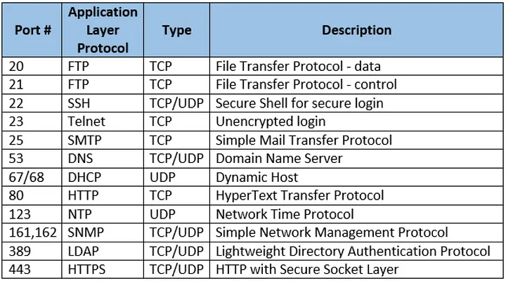

# Protocols

[osi-model.md](osi-model.md "mention") For a comprehensive list of protocols at each layer, refer to the OSI model.

<figure><figcaption></figcaption></figure>

## Ports:

In networking, a port is a communication endpoint that allows a computer to host multiple network services simultaneously. Ports enable different applications or processes on a single device to use network resources without interfering with each other. The concept of ports is an integral part of the transport layer in the OSI model.

Here are key points about ports:

1. **Port Numbers:**
   * Port numbers are 16-bit unsigned integers, allowing for a range from 0 to 65535.
   * Ports are categorized into three ranges:
     * **Well-known ports (0-1023):** Reserved for standard services (e.g., HTTP on port 80, FTP on port 21).
     * **Registered ports (1024-49151):** Assigned to specific applications by the Internet Assigned Numbers Authority (IANA).
     * **Dynamic or Private ports (49152-65535):** Used for private or temporary purposes.
2. **Socket:**
   * A combination of IP address and port number is called a socket.
   * It uniquely identifies a communication channel between two devices on a network.
3. **Role of Ports:**
   * Ports help direct network traffic to the appropriate application or service on a device.
   * When a computer receives a packet, the port number in the packet header determines which application or process on that computer should handle the data.
4. **Common Use Cases:**
   * Web servers typically use port 80 for unencrypted HTTP and port 443 for encrypted HTTPS.
   * Email services use port 25 for SMTP (Simple Mail Transfer Protocol) and ports 110/995 for POP3 (Post Office Protocol) or IMAP (Internet Message Access Protocol).
   * FTP (File Transfer Protocol) uses ports 20 and 21.
   * Commonly used ports for various applications are standardized for consistency.
5. **Dynamic Ports:**
   * Some ports are dynamically assigned by the operating system for temporary use.
   * For example, when a client connects to a web server, the server responds from a dynamically assigned port.
6. **Firewall and Security:**
   * Firewalls use port numbers to control and filter network traffic.
   * Security considerations involve closing unnecessary ports to reduce the attack surface.

Understanding and managing ports are crucial for configuring network services, ensuring secure communication, and troubleshooting network-related issues.

## Details on Each Protocol:

* **FTP**:
* **SSH**:
  *

      SSH is a protocol that allows users to log into a remote machine securely over a network, such as the internet. It encrypts the data being transmitted, preventing eavesdropping or interception of sensitive information.

      How to connect to a remote server:

      * Need:
        * ssh server (install using apt - openssh-server)
        * Credentials
          * password
            * Please note that it's generally recommended to use SSH key authentication for security instead of password-based authentication. If you have an SSH key pair, you can use it to connect to the server for a more secure and convenient login.
            * SSH key authentication is a more secure and convenient method for authenticating to a remote server compared to password-based authentication. It relies on public-key cryptography and eliminates the need to enter a password each time you connect to the server.
              * **Setting Up SSH Key Authentication**:
                * To set up SSH key authentication, you generate a key pair on your local machine using the **`ssh-keygen`** command. This command will create a public key (usually named **`id_rsa.pub`**) and a private key (usually named **`id_rsa`**) in the **`~/.ssh/`** directory.
                * You copy the public key to the **`~/.ssh/authorized_keys`** file on the server you want to access. This file can contain multiple public keys, one per line, allowing multiple users to access the server with their own keys.
                * You can protect your private key with a passphrase, adding an extra layer of security.
          * username (optional, can use `root` instead)
          * IP address
* **Telnet**:
* **SMTP**
* **IMAP**
* **POP3**
* **DNS**
* **DHCP**
* **HTTP/s**

